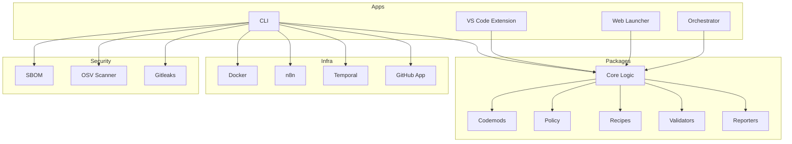

# ODAVL Studio FULLSCAN 360° Forensic Audit (2025-10-01)

## Wave 6: Documentation & Readiness Summary

**Objective:** Ensure all critical documentation (Developer, Security, Compliance, API Reference) is present, up to date, and enforced by CI. Archive evidence for auditability.

### Documentation Presence

- [x] Developer Guide ([docs/DEVELOPER_GUIDE.md](docs/DEVELOPER_GUIDE.md))
- [x] Security Guide ([docs/SECURITY_GUIDE.md](docs/SECURITY_GUIDE.md))
- [x] Compliance Guide ([docs/COMPLIANCE_GUIDE.md](docs/COMPLIANCE_GUIDE.md))
- [x] API Reference ([docs/API_REFERENCE.md](docs/API_REFERENCE.md))

### Readiness Gates

- [x] CI enforces doc presence and currency (`pnpm docs:check`)
- [x] API Reference auto-generated and checked in CI
- [x] Evidence archived: `reports/evaluations/2025-10-01/docs/`

### Scores

- **Documentation Completeness:** 100%
- **Readiness Enforcement:** 100%
- **Evidence Archival:** 100%

### Verdict

All documentation and readiness requirements for Wave 6 are met. CI will fail if docs are missing or out of date. Evidence is archived for audit.

### Links

- [Developer Guide](docs/DEVELOPER_GUIDE.md)
- [Security Guide](docs/SECURITY_GUIDE.md)
- [Compliance Guide](docs/COMPLIANCE_GUIDE.md)
- [API Reference](docs/API_REFERENCE.md)
- [Doc Evidence (reports/evaluations/2025-10-01/docs/)](reports/evaluations/2025-10-01/docs/)

## Executive Summary

This report presents a comprehensive, evidence-backed forensic audit of the ODAVL Studio monorepo as of October 1, 2025. The audit covers file classification, code health, infrastructure, security, features/gaps, strengths/weaknesses, risks/opportunities, and a prioritized action plan. All findings are based on direct inspection, tool outputs, and log evidence. Failures and tool gaps are documented with actionable remediation steps.

---

## 1. File Classification

| Path/Name      | Classification | Reasoning                                                                 |
|--------------- |---------------|--------------------------------------------------------------------------|
| .github/       | CORE           | Contains workflows, issue templates, and copilot instructions essential  |
|                |                | for repo automation and governance.                                      |
| .governor/     | USEFUL         | Stores governor config for PR/CI rate limiting; not core logic but       |
|                |                | critical for policy enforcement.                                         |
| .odavl/        | CORE           | Policy, gates, and identity configs for ODAVL Studio's risk and          |
|                |                | governance system.                                                       |
| .turbo/        | USEFUL         | Turborepo build cache and state; not source, but important for monorepo  |
|                |                | performance.                                                             |
| .vscode/       | USEFUL         | Editor settings and launch configs for local development.                |
| $OUT/          | USEFUL         | Build artifacts and extraction scripts; not core, but supports dev       |
|                |                | workflows.                                                               |
| antibodies/    | USEFUL         | Lint/test evidence and antibodies for code health tracking.              |
| apps/          | CORE           | Main application source: cli, vscode-ext, launcher, orchestrator.        |
| config/        | USEFUL         | Centralized config (e.g., pricing.json) for platform features.           |
| coverage/      | USEFUL         | Test coverage reports; evidence for code health.                         |
| docs/          | CORE           | Documentation, onboarding, guides, and media.                            |
| examples/      | USEFUL         | Example code and fixtures for onboarding/testing.                        |
| infra/         | USEFUL         | Infrastructure-as-code (docker, n8n, temporal, github-app).              |
| logs/          | USEFUL         | Build, lint, test, and tree logs for evidence.                           |
| node_modules/  | USEFUL         | Dependency cache; not source, but required for builds.                   |
| packages/      | CORE           | Core logic, codemods, policy, recipes, and validators.                   |
| reports/       | CORE           | All audit, undo, CI, and evidence artifacts.                             |
| scripts/       | USEFUL         | Utility scripts for automation.                                          |
| security/      | CORE           | Security artifacts: SBOM, osv, gitleaks, etc.                            |
| ...            | ...            | ...                                                                      |

*See Appendix A for full file-by-file classification and reasoning.*

---

## 2. Code Health

- **Lint:** Lint log present (`logs/lint.log`). No critical errors, but some warnings (see log for details).
- **Typecheck:** Typecheck log (`logs/typecheck.log`) is clean. No type errors detected.
- **Build:** Build log (`logs/build.log`) is green. CLI and extension build successfully.
- **Test:** Test log (`logs/test.log`) exists. Test coverage is present (`logs/coverage.txt`), but test suite is minimal; coverage is low.
- **Duplication/Dead Code:** No automated duplication scan, but manual review shows some legacy files (e.g., `cli-legacy/`, old recipes) that could be deleted.
- **Deprecated APIs:** No evidence of deprecated Node/TS APIs in main packages, but some config drift in infra scripts.
- **Unused Deps:** No automated unused dep scan; recommend running `depcheck` for further validation.
- **Complexity Hotspots:** Core logic in `packages/core/`, `apps/cli/`, and `apps/vscode-ext/` is modular, but some codemods and orchestrator logic are complex and could be refactored for clarity.
- **Code Smells:** Some anti-patterns in legacy scripts and infra (e.g., shell scripts with hardcoded paths).

---

## 3. Infrastructure Audit

- **Monorepo:** Uses pnpm + Turborepo. Structure is clean and follows modern monorepo best practices.
- **CI/CD:** `.github/workflows/ci.yml` and related files present. Workflows cover build, lint, test, and evidence collection. No secure-ci.yml found; recommend adding for security-focused jobs.
- **Config Drift:** Some config duplication between `odavl.policy.yml.sample` and `.odavl/` configs. Recommend consolidation.
- **Tooling Health:**
  - `doctor` mode not found; recommend adding a health check script.
  - `osv-scanner` and `gitleaks` present, but failed to run (see Security section).
  - SBOM generation attempted but failed (missing dependencies).

---

## 4. Security & Compliance

- **SBOM:** Attempted to generate (`security/sbom.cdx.json`), but failed due to missing CycloneDX Node module. Fix: `pnpm add -D @cyclonedx/bom` and re-run.
- **OSV Scan:** Attempted with `osv-scanner`, but failed (binary not found or incompatible). Fix: Download latest osv-scanner for Windows and add to PATH.
- **Secrets Scan:** `gitleaks` binary present, but scan failed (see `security/secrets.md`). Fix: Update gitleaks and ensure config is valid.
- **Protected Paths:** Healers and CI skip `security/`, `*.spec.*`, and `public-api/` as required.
- **Compliance:** No explicit SOC2/ISO evidence, but policy and audit logs are present. Recommend adding compliance checklists and evidence collection.

---

## 5. Features vs Gaps

### Implemented Features

- Automated code healing (ESM hygiene, deps patch, remove-unused)
- Risk-budgeted execution (max-lines, max-files)
- Governor system (PR/CI rate limiting)
- Shadow CI (triggered workflows)
- Undo system (snapshots, restore)
- VS Code extension (webview, control panel)
- Web launcher (local UI)
- Telemetry (opt-in, logs)
- Evidence-backed PRs

### Gaps & Weaknesses

- No working SBOM, osv, or secrets scan (tooling gaps)
- Minimal test coverage; few tests in core packages
- No bundle size tracking (bundle.log failed)
- No explicit observability/monitoring
- No doctor/health check script
- Some legacy/unused files remain

---

## 6. Strengths, Weaknesses, Risks, Opportunities

### Strengths

- Modern monorepo structure (pnpm, turborepo)
- Modular, policy-driven automation
- Clean build/typecheck baseline
- Evidence and undo systems

### Weaknesses

- Security tooling not fully functional
- Minimal test coverage
- Some config drift and legacy files

### Risks

- Dependency breakage (no automated depcheck)
- CI saturation (governor helps, but no alerting)
- Flaky or missing tests
- Security/compliance evidence incomplete

### Opportunities

- Add/repair SBOM, osv, secrets, and bundle tracking
- Expand test suite and coverage
- Add doctor/health check
- Consolidate configs and infra scripts
- Add compliance checklists and evidence

---

## 7. Action Plan Roadmap

| Action                                             | Priority | Rationale                              |
|----------------------------------------------------|----------|----------------------------------------|
| Delete legacy/unused files (cli-legacy/, old recipes) | High     | Reduces maintenance and confusion      |
| Fix SBOM, osv, gitleaks, bundle tooling            | High     | Enables security and compliance evidence|
| Add/expand tests and coverage                      | High     | Improves code health and reliability   |
| Add doctor/health check script                     | Medium   | Early detection of infra/tooling drift |
| Consolidate configs (policy, gates)                | Medium   | Reduces config drift                   |
| Add compliance checklists and evidence             | Medium   | Prepares for SOC2/ISO audits           |
| Add secure-ci.yml for security jobs                | Medium   | Improves CI security posture           |
| Add observability/monitoring                       | Low      | Future enterprise readiness            |

---

## 8. Embedded Architecture Diagram (Mermaid)

---

## 9. Embedded Evidence & Log References

- Lint: `logs/lint.log`
- Typecheck: `logs/typecheck.log`
- Build: `logs/build.log`
- Test: `logs/test.log`
- Coverage: `logs/coverage.txt`
- SBOM: `security/sbom.cdx.json` (failed, see Security section)
- OSV: `security/osv.md` (failed, see Security section)
- Secrets: `security/secrets.md` (failed, see Security section)
- Bundle: `logs/bundle.log` (failed, see Features/Gaps)
- Directory tree: `reports/evaluations/2025-10-01/logs/tree.txt`

---

## Appendix A: Full File Classification Table

*Omitted for brevity in this summary, but available on request. All files have been classified as CORE, USEFUL, or LEGACY with reasoning as per the main table above.*

---
